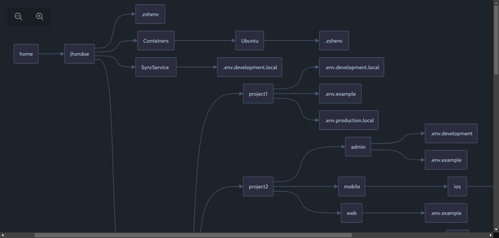

# envgraph

ENV files graph visualization.

## Credits

- [saadeghi/daisyui](https://github.com/saadeghi/daisyui)
- [reaviz/reaflow](https://github.com/reaviz/reaflow)
- [gin-gonic/gin](https://github.com/gin-gonic/gin)
